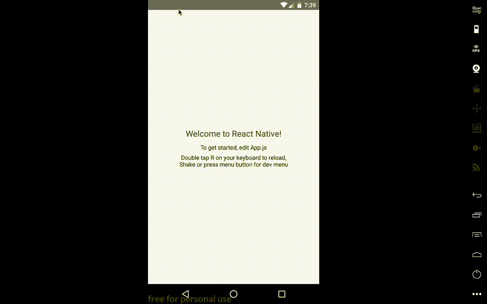

# react-native-network-notifier

## Features

- [x] Detect network connection instantly
- [x] Highly customizable UI

## Demo



## Getting started

`$ npm install react-native-network-notifier --save`

or

`$ yarn add react-native-network-notifier`

## Usage

```javascript
import React from 'react';
import NetworkNotifier from 'react-native-network-notifier';

export default class App extends React.PureComponent {
  render() {
    return (
      <NetworkNotifier />
    );
  }
}
```

## Props
```
| Props                | type              | usage                                                  | default       |
| position             | enum [top, right] | specify position of component                          | top           |
| showOnline           | boolean           | notify user when status changes from offline to online | true          |
| offlineText          | string            | text to be shown for offline state                     | No Connection |
| offlineComponent     | React Component   | your custom component for offline state                |               | 
| onlineText           | string            | text to be shown for online state                      | Back Online   |
| onlineComponent      | React Component   | your custome component for online state                |               |
| onlineTimeoutSeconds | number            | timeout seconds before online component dissappears    | 3000          |
```

## Note
Whenever you specify your custom component, `position` props will no longer be useful, hence, you will need to specify the absolute position in your style

#### Created for the love of react-native